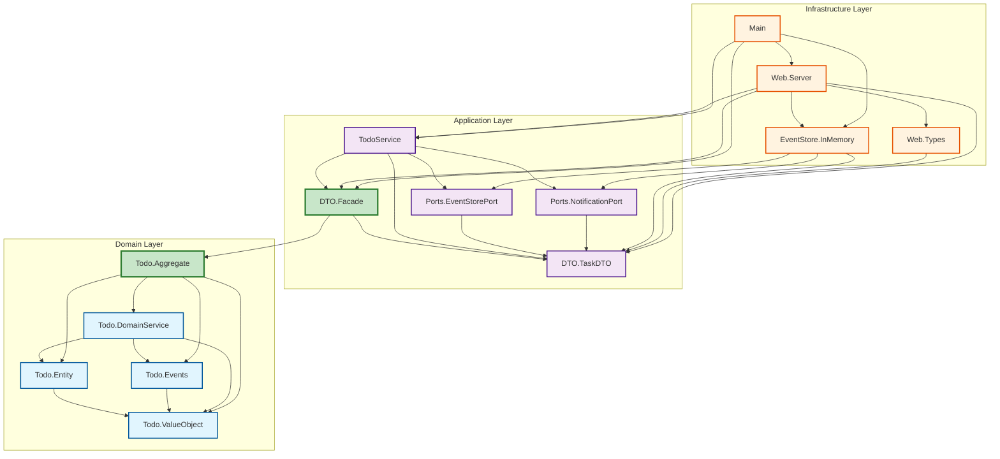

# Todo DDD Project

Haskell implementation of a Todo application using Domain-Driven Design (DDD) principles, Event Sourcing, and Hexagonal Architecture.

## Current Status (2025-09-30)

**Implementation Status**
- Type-safe ADT-based event system with `EventType` ADT
- Event Sourcing using STM-based in-memory event store
- Hexagonal Architecture with three-layer separation
- REST API server on port 8080 with CORS middleware
- Dual Facade Pattern between Domain and Application layers
- Backward-compatible event type conversion supporting legacy names
- Sample data initialization on startup
- Complete JSON serialization for DTOs and events

## Architecture Overview

The project implements a three-layer architecture with dependency inversion and type-safe event handling. Domain logic is isolated from infrastructure concerns through the Facade pattern. The domain layer uses ADT-based events (`EventType`) instead of string literals for compile-time type safety.

## Ubiquitous Language

This project uses a two-level terminology strategy to distinguish between domain scope and entity level:

### Terminology Design

| Term | Abstraction Level | Usage | Meaning |
|------|------------------|-------|---------|
| **Todo** | Domain/Context | `TodoService`, `TodoAPI`, `TodoEventDTO`, `Domain/Todo/` | Refers to the overall **Todo application domain** as a bounded context |
| **Task** | Entity | `Task`, `TaskDTO`, `TaskId`, `TaskDescription`, `/api/tasks` | Refers to a concrete **task item** (a specific "thing to do") within the domain |

### Key Principles

1. **Todo = Bounded Context**: The term "Todo" represents the application domain as a whole
   - `TodoService`: Service managing the Todo domain
   - `TodoAPI`: Complete API for the Todo application
   - `TodoEventDTO`: Events occurring within the Todo domain context
   - `Domain/Todo/`: Directory representing the Todo bounded context

2. **Task = Domain Entity**: The term "Task" represents individual work items
   - `Task`: Core domain entity representing a single task
   - `TaskDTO`: Data transfer object for task serialization
   - `TaskId`, `TaskDescription`: Value objects identifying and describing tasks
   - `/api/tasks`: REST endpoint for task resources (plural form)

3. **Event Naming Convention**:
   - `TodoEventDTO`: "Events in the Todo domain" (domain-level abstraction)
   - Event types use entity-level terminology: `TaskInitiated`, `TaskCompleted`, `TaskReopened`, `TaskDeleted`
   - This allows future extension to other event types (e.g., `UserEvent`) while maintaining the Todo domain context

### Consistency Across Layers

- **Domain Layer**: 100% uses `Task` terminology for entities and value objects
- **Application Layer**: Uses `Task` for operations, `Todo` for services and domain-wide concepts
- **Infrastructure Layer**: Uses `Task` in API paths (`/api/tasks`), `Todo` for API type definitions (`TodoAPI`)

This terminology strategy aligns with DDD's **Context Mapping** principles, where `Todo` represents the bounded context and `Task` represents the core entity within that context.

## Module Dependencies

The following Mermaid diagram shows the dependency relationships between modules with the implemented Facade Pattern:



## Dependency Rules

The architecture implements Dependency Inversion Principle with Facade Pattern:

1. **Domain Layer**: Pure business logic with no external dependencies
   - `Domain.Todo.ValueObject`: Smart constructors (`mkTaskId`, `mkTaskDescription`)
   - `Domain.Todo.Entity`: Task entity with `TaskId`, `TaskDescription`, `isCompleted`
   - `Domain.Todo.Events`: `EventType` ADT (TaskInitiated, TaskCompleted, TaskReopened, TaskDeleted) and `DomainEvent` record
   - `Domain.Todo.DomainService`: Event projection (`projectEvents`, `projectToSnapshots`) and queries
   - `Domain.Todo.Aggregate`: `TodoDomainFacade` providing command handlers, event conversion, and `DTOConversionSupport`

2. **Application Layer**: Use case orchestration through domain facade
   - `Application.DTO.TaskDTO`: DTOs (`TaskDTO`, `TodoEventDTO`, `TasksStatisticsDTO`) with JSON instances
   - `Application.DTO.Facade`: `DomainOperations` facade importing only `Domain.Todo.Aggregate`
   - `Application.TodoService`: `TodoService` implementation with `EventStore` and `NotificationPort` constraints
   - `Application.Ports.EventStorePort`: `EventStore` type class for event persistence
   - `Application.Ports.NotificationPort`: `NotificationPort` type class for event notifications

3. **Infrastructure Layer**: Technical adapters implementing application ports
   - `Infrastructure.EventStore.InMemory`: `AppM`/`AppIO` monads with STM-based `TVar [TodoEventDTO]` storage
   - `Infrastructure.Web.Types`: Servant API type (`TodoAPI`) and request/response types
   - `Infrastructure.Web.Server`: CORS-enabled Servant server with handler implementations

4. **Main Application**: Dependency injection and initialization
   - `app/Main.hs`: `initializeApp`, `initializeSampleData`, Warp server on port 8080

### Design Patterns

- **Hexagonal Architecture**: Separation of business logic from infrastructure
- **Facade Pattern**: `TodoDomainFacade` in `Domain.Todo.Aggregate` provides domain interface
- **Event Sourcing**: State represented as event sequence, events stored in STM-based event store
- **CQRS**: Command-Query Responsibility Segregation with separate read models
- **Dependency Injection**: Port and Adapter pattern for infrastructure abstraction
- **Anti-Corruption Layer**: Domain isolation via dual facades (Domain + Application)
- **Type Safety**: ADT-based event types (`EventType`) prevent runtime string errors
- **Smart Constructors**: Value object validation through `mkTaskId` and `mkTaskDescription`

### Facade Pattern Implementation

The architecture employs dual facades for layer separation:

#### Domain.Todo.TodoDomainFacade
- Input Types: `TaskInitiationRequest`, `TaskUpdateRequest`
- Output Types: `TaskSnapshot`, `TaskEventRecord`
- Internal Types: `TaskId`, `TaskDescription`, `Task`, `DomainEvent`
- Event Types: `EventType` ADT (`TaskInitiated`, `TaskCompleted`, `TaskReopened`, `TaskDeleted`)
- Functionality: `DTOConversionSupport` for type conversion
- Responsibilities: Event sourcing, validation, projection, type-safe event handling

#### Application.DTO.Facade
- Domain Import: `Domain.Todo.Aggregate` only
- Interface: `DomainOperations` for DTO-based operations
- Conversion: Utilizes `TodoDomainFacade.dtoConversion`
- Purpose: Anti-corruption layer between Application and Domain

### Layer Responsibilities

- **Domain**: Value Objects, Entities, Events, and Aggregate logic (pure business rules)
  - Type-safe event sourcing with EventType ADT (`TaskInitiated`, `TaskCompleted`, `TaskReopened`, `TaskDeleted`)
  - Domain validation through smart constructors
  - Business invariant enforcement
  - Compile-time event type validation through pattern matching
  - DomainEvent record type as primary event representation
- **Application**: Use Cases, DTOs, Port interfaces, and orchestration
  - Service composition through `TodoService`
  - DTO-based external communication
  - Port definitions for infrastructure dependencies
- **Infrastructure**: Technical adapters implementing application ports
  - STM-based in-memory event store
  - Servant-based HTTP API with CORS support
  - JSON serialization and request/response handling

## File Structure

```
todo-ddd/
├── app/
│   └── Main.hs                                 # Application entry point with initialization
├── src/
│   ├── Domain/
│   │   └── Todo/
│   │       ├── ValueObject.hs                  # TaskId, TaskDescription with smart constructors
│   │       ├── Entity.hs                       # Task entity (taskId, taskDescription, isCompleted)
│   │       ├── Events.hs                       # EventType ADT and DomainEvent record
│   │       ├── DomainService.hs                # Event projection and query functions
│   │       └── Aggregate.hs                    # TodoDomainFacade with DTOConversionSupport
│   ├── Application/
│   │   ├── DTO/
│   │   │   ├── TaskDTO.hs                      # TaskDTO, TodoEventDTO, TasksStatisticsDTO
│   │   │   └── Facade.hs                       # DomainOperations facade
│   │   ├── Ports/
│   │   │   ├── EventStorePort.hs               # EventStore interface
│   │   │   └── NotificationPort.hs             # NotificationPort interface
│   │   └── TodoService.hs                      # TodoService implementation
│   └── Infrastructure/
│       ├── EventStore/
│       │   └── InMemory.hs                     # STM-based event store (AppM/AppIO)
│       ├── Web/
│       │   ├── Types.hs                        # HTTP types and TodoAPI definition
│       │   └── Server.hs                       # Servant server with CORS
│       └── UI/                                 # React frontend (Vite + TypeScript + TailwindCSS)
│           ├── src/
│           │   ├── App.tsx                     # Main React component
│           │   ├── api.ts                      # API client with type-safe DTOs
│           │   └── main.tsx                    # React entry point
│           ├── public/                         # Static assets
│           ├── index.html                      # HTML entry point
│           ├── package.json                    # Node dependencies
│           ├── vite.config.ts                  # Vite configuration
│           ├── tsconfig.json                   # TypeScript configuration
│           └── tailwind.config.js              # TailwindCSS configuration
├── test/
│   └── Spec.hs                                 # Test specifications
├── package.yaml                                # Hpack project configuration
├── todo-ddd.cabal                              # Generated Cabal file
├── stack.yaml                                  # Stack configuration
└── README.md                                   # Project documentation
```

## Development Environment Setup

### Prerequisites

- **GHC**: 9.6.7 (Glasgow Haskell Compiler)
- **Cabal**: 3.12.1.0
- **Stack**: 3.3.1 (LTS 21.25)
- **HLS**: 2.10.0.0 (Haskell Language Server)
- **Hpack**: For generating `.cabal` from `package.yaml`
- **Node.js**: 18+ (for React frontend)

### Option 1: Docker + Dev Container (Recommended)

The easiest way to set up the environment using Docker and VS Code Dev Containers.

**Requirements:**
- Docker Desktop
- Visual Studio Code
- Dev Containers extension for VS Code

**Steps:**

1. Open this project folder in VS Code
2. Press `F1` and select **"Dev Containers: Reopen in Container"**
3. Wait for the container to build (first time takes ~10 minutes)
4. The environment is ready with all tools pre-installed

The [Dockerfile](Dockerfile) and [.devcontainer/devcontainer.json](.devcontainer/devcontainer.json) are included in this repository.

**What's included:**
- GHC 9.6.7, Cabal 3.12.1.0, Stack 3.3.1, HLS 2.10.0.0
- Development tools: hlint, hoogle, ormolu, fourmolu, ghcid, hpack
- VS Code extensions: Haskell, HLS, ErrorLens, GitLens
- Automatic dependency installation via `postCreateCommand`

### Option 2: Local Installation with GHCup

**Linux / macOS / WSL2:**

```bash
# Install GHCup
curl --proto '=https' --tlsv1.2 -sSf https://get-ghcup.haskell.org | sh

# Install required versions
ghcup install ghc 9.6.7 --set
ghcup install cabal 3.12.1.0 --set
ghcup install hls 2.10.0.0 --set
ghcup install stack 3.3.1 --set

# Update cabal and install hpack
cabal update
cabal install --global hpack hlint --overwrite-policy=always
```

**System dependencies (Ubuntu/Debian):**
```bash
sudo apt-get install -y build-essential libgmp-dev zlib1g-dev \
    libtinfo-dev libncurses-dev pkg-config
```

**macOS:**
```bash
brew install gmp ncurses
```

### VS Code Configuration

The [.vscode/settings.json](.vscode/settings.json) file is included with recommended settings:

- HLS integration with GHCup
- Fourmolu as formatter
- Format on save enabled
- HLint diagnostics enabled
- Optimized for Haskell development

## Build and Execution

```bash
# Generate .cabal file from package.yaml (if modified)
hpack

# Build the project
cabal build

# Run the server (starts on http://localhost:8080)
cabal run todo-ddd-exe

# Run REPL for experimentation
cabal repl
```

## User Interface

The project includes a React-based web UI built with Vite, TypeScript, and TailwindCSS.

### Starting the Application

**Backend (Haskell API Server)**
```bash
cd /work/todo-ddd
cabal run todo-ddd-exe
# Server starts on http://localhost:8080
```

**Frontend (React UI)**
```bash
cd /work/todo-ddd/src/Infrastructure/UI
npm install  # First time only
npm run dev
# UI available at http://localhost:5173
```

### UI Features

- Task creation with Enter key support
- Task completion toggle via checkbox
- Task deletion
- Real-time statistics display (Total/Active/Completed)
- Event history visualization panel
- Connection status indicator
- Auto-refresh every 2 seconds via polling

### UI Technical Stack

- **Vite**: Build tool with fast HMR
- **React 18**: UI framework with TypeScript
- **TailwindCSS**: Utility-first styling
- **Type-safe API client**: Matches Haskell DTOs

See [src/Infrastructure/UI/README.md](src/Infrastructure/UI/README.md) for UI development details.

## API Endpoints

The REST API provides the following endpoints:

- `GET /api/tasks`: List all tasks with statistics
- `POST /api/tasks`: Create/Initiate new task
  - Request body: `{"requestText": "task description"}`
  - Response: `{"createId": "task-id"}`
- `POST /api/tasks/toggle`: Toggle task completion status
  - Request body: `{"toggleId": "task-id"}`
- `POST /api/tasks/delete`: Delete task
  - Request body: `{"deleteId": "task-id"}`
- `GET /api/events`: View complete event history

### Testing the API

```bash
# Start the server
cabal run todo-ddd-exe
# Server runs on http://localhost:8080

# Create a task
curl -X POST http://localhost:8080/api/tasks \
  -H "Content-Type: application/json" \
  -d '{"requestText": "Learn DDD with Haskell"}'

# Get all tasks
curl http://localhost:8080/api/tasks

# Toggle task completion
curl -X POST http://localhost:8080/api/tasks/toggle \
  -H "Content-Type: application/json" \
  -d '{"toggleId": "your-task-id"}'

# View event history
curl http://localhost:8080/api/events
```
