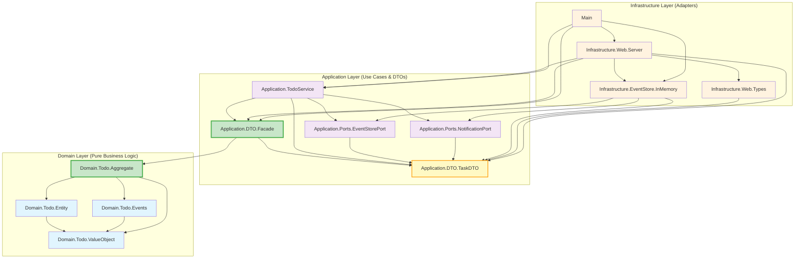

# Todo DDD Project

Haskell implementation of a Todo application using Domain-Driven Design (DDD) principles, Event Sourcing, and Hexagonal Architecture.

## Current Status (2025-09-30)

- Type-safe ADT-based event system implemented
- Event Sourcing with STM-based in-memory event store
- Hexagonal Architecture with three-layer separation
- REST API operational on port 8080
- Dual Facade Pattern between Domain/Application layers
- Backward-compatible event type conversion

## Architecture Overview

The project follows a three-layer architecture with dependency inversion and type-safe event handling. Domain logic is isolated from infrastructure concerns through the Facade pattern. The domain layer has been successfully migrated from string-based events to a type-safe ADT-based event system.

## Ubiquitous Language

This project uses a two-level terminology strategy to distinguish between domain scope and entity level:

### Terminology Design

| Term | Abstraction Level | Usage | Meaning |
|------|------------------|-------|---------|
| **Todo** | Domain/Context | `TodoService`, `TodoAPI`, `TodoEventDTO`, `Domain/Todo/` | Refers to the overall **Todo application domain** as a bounded context |
| **Task** | Entity | `Task`, `TaskDTO`, `TaskId`, `TaskDescription`, `/api/tasks` | Refers to a concrete **task item** (a specific "thing to do") within the domain |

### Key Principles

1. **Todo = Bounded Context**: The term "Todo" represents the application domain as a whole
   - `TodoService`: Service managing the Todo domain
   - `TodoAPI`: Complete API for the Todo application
   - `TodoEventDTO`: Events occurring within the Todo domain context
   - `Domain/Todo/`: Directory representing the Todo bounded context

2. **Task = Domain Entity**: The term "Task" represents individual work items
   - `Task`: Core domain entity representing a single task
   - `TaskDTO`: Data transfer object for task serialization
   - `TaskId`, `TaskDescription`: Value objects identifying and describing tasks
   - `/api/tasks`: REST endpoint for task resources (plural form)

3. **Event Naming Convention**:
   - `TodoEventDTO`: "Events in the Todo domain" (domain-level abstraction)
   - Event types use entity-level terminology: `TaskInitiated`, `TaskCompleted`, `TaskReopened`, `TaskDeleted`
   - This allows future extension to other event types (e.g., `UserEvent`) while maintaining the Todo domain context

### Consistency Across Layers

- **Domain Layer**: 100% uses `Task` terminology for entities and value objects
- **Application Layer**: Uses `Task` for operations, `Todo` for services and domain-wide concepts
- **Infrastructure Layer**: Uses `Task` in API paths (`/api/tasks`), `Todo` for API type definitions (`TodoAPI`)

This terminology strategy aligns with DDD's **Context Mapping** principles, where `Todo` represents the bounded context and `Task` represents the core entity within that context.

## Module Dependencies

The following Mermaid diagram shows the dependency relationships between modules with the implemented Facade Pattern:



## Dependency Rules

The architecture implements Dependency Inversion Principle with Facade Pattern:

1. **Domain Layer**: Contains business logic without external dependencies
   - `Domain.Todo.ValueObject`: Value objects with validation
   - `Domain.Todo.Entity`: Domain entities
   - `Domain.Todo.Events`: Event definitions for event sourcing
   - `Domain.Todo.Aggregate`: Aggregate root providing domain boundary and `DTOConversionSupport`

2. **Application Layer**: Orchestrates use cases through aggregates
   - `Application.DTO.TaskDTO`: Data Transfer Objects without domain imports
   - `Application.DTO.Facade`: Bridge module importing only `Aggregate`
   - `Application.TodoService`: Service implementation using `DomainOperations`
   - `Application.Ports.*`: Infrastructure interface definitions

3. **Infrastructure Layer** (Orange): Technical implementations of ports
   - `Infrastructure.EventStore.InMemory`: STM-based event storage
   - `Infrastructure.Web.*`: Servant-based HTTP API implementation

4. **Main Application** (Pink): Dependency injection and startup

### Design Patterns

- Hexagonal Architecture: Separation of business logic from infrastructure
- Facade Pattern: `TodoDomainFacade` type in `Domain.Todo.Aggregate` provides domain interface
- Event Sourcing: State represented as event sequence
- CQRS: Command-Query Responsibility Segregation
- Dependency Injection: Port and Adapter pattern
- Anti-Corruption Layer: Domain isolation via facades
- Type Safety: ADT-based event types (`EventType`) prevent runtime string errors
- Pattern Matching: Exhaustive compile-time validation through ADT pattern matching

### Facade Pattern Implementation

The architecture employs dual facades for layer separation:

#### Domain.Todo.TodoDomainFacade
- Input Types: `TaskInitiationRequest`, `TaskUpdateRequest`
- Output Types: `TaskSnapshot`, `TaskEventRecord`
- Internal Types: `TaskId`, `TaskDescription`, `Task`, `DomainEvent`
- Event Types: `EventType` ADT (`TaskInitiated`, `TaskCompleted`, `TaskReopened`, `TaskDeleted`)
- Functionality: `DTOConversionSupport` for type conversion
- Responsibilities: Event sourcing, validation, projection, type-safe event handling

#### Application.DTO.Facade
- Domain Import: `Domain.Todo.Aggregate` only
- Interface: `DomainOperations` for DTO-based operations
- Conversion: Utilizes `TodoDomainFacade.dtoConversion`
- Purpose: Anti-corruption layer between Application and Domain

### Layer Responsibilities

- **Domain**: Value Objects, Entities, Events, and Aggregate logic (pure business rules)
  - Type-safe event sourcing with EventType ADT (`TaskInitiated`, `TaskCompleted`, `TaskReopened`, `TaskDeleted`)
  - Domain validation through smart constructors
  - Business invariant enforcement
  - Compile-time event type validation through pattern matching
  - DomainEvent record type as primary event representation
- **Application**: Use Cases, DTOs, Port interfaces, and orchestration
  - Service composition through `TodoService`
  - DTO-based external communication
  - Port definitions for infrastructure dependencies
- **Infrastructure**: Technical adapters implementing application ports
  - STM-based in-memory event store
  - Servant-based HTTP API with CORS support
  - JSON serialization and request/response handling

## File Structure

### Domain Layer
- `src/Domain/Todo/ValueObject.hs` - TaskId, TaskDescription value objects with smart constructors
- `src/Domain/Todo/Entity.hs` - Task entity definition
- `src/Domain/Todo/Events.hs` - Type-safe domain events with EventType ADT and DomainEvent record
- `src/Domain/Todo/Aggregate.hs` - Aggregate root with DomainEvent-based implementation

### Application Layer
- `src/Application/DTO/TaskDTO.hs` - Data Transfer Objects with JSON serialization
- `src/Application/DTO/Facade.hs` - Bridge adapter (`DomainOperations`) between layers
- `src/Application/TodoService.hs` - Use case implementations and service composition
- `src/Application/Ports/EventStorePort.hs` - Event storage interface
- `src/Application/Ports/NotificationPort.hs` - Event notification interface

### Infrastructure Layer
- `src/Infrastructure/EventStore/InMemory.hs` - STM-based event storage with `AppM`/`AppIO` monads
- `src/Infrastructure/Web/Types.hs` - HTTP request/response types and Servant API definition
- `src/Infrastructure/Web/Server.hs` - HTTP server implementation with CORS support

### Application Entry
- `app/Main.hs` - Application startup, dependency injection, sample data initialization

## Build and Execution

```bash
# Generate .cabal file from package.yaml (if modified)
hpack

# Build the project
cabal build

# Run the server (starts on http://localhost:8080)
cabal run todo-ddd-exe

# Run REPL for experimentation
cabal repl
```

## API Endpoints

The REST API provides the following endpoints:

- `GET /api/tasks`: List all tasks with statistics
- `POST /api/tasks`: Create/Initiate new task
  - Request body: `{"requestText": "task description"}`
  - Response: `{"createId": "task-id"}`
- `POST /api/tasks/toggle`: Toggle task completion status
  - Request body: `{"toggleId": "task-id"}`
- `POST /api/tasks/delete`: Delete task
  - Request body: `{"deleteId": "task-id"}`
- `GET /api/events`: View complete event history

### Testing the API

```bash
# Start the server
cabal run todo-ddd-exe
# Server runs on http://localhost:8080

# Create a task
curl -X POST http://localhost:8080/api/tasks \
  -H "Content-Type: application/json" \
  -d '{"requestText": "Learn DDD with Haskell"}'

# Get all tasks
curl http://localhost:8080/api/tasks

# Toggle task completion
curl -X POST http://localhost:8080/api/tasks/toggle \
  -H "Content-Type: application/json" \
  -d '{"toggleId": "your-task-id"}'

# View event history
curl http://localhost:8080/api/events
```
