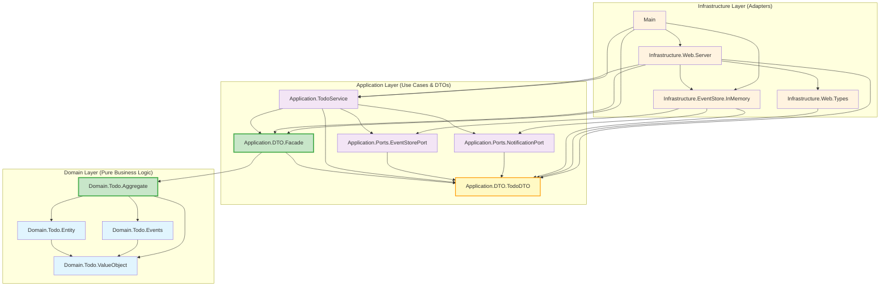

# Todo DDD Project

Haskell implementation of a Todo application using Domain-Driven Design (DDD) principles, Event Sourcing, and Hexagonal Architecture.

## Architecture Overview

The project follows a three-layer architecture with dependency inversion and type-safe event handling. Domain logic is isolated from infrastructure concerns through the Facade pattern. The domain layer has been successfully migrated from string-based events to a type-safe ADT-based event system.

## Module Dependencies

The following Mermaid diagram shows the dependency relationships between modules with the implemented Facade Pattern:



## Dependency Rules

The architecture implements Dependency Inversion Principle with Facade Pattern:

1. **Domain Layer**: Contains business logic without external dependencies
   - `Domain.Todo.ValueObject`: Value objects with validation
   - `Domain.Todo.Entity`: Domain entities
   - `Domain.Todo.Events`: Event definitions for event sourcing
   - `Domain.Todo.Aggregate`: Aggregate root providing domain boundary and `DTOConversionSupport`

2. **Application Layer**: Orchestrates use cases through aggregates
   - `Application.DTO.TodoDTO`: Data Transfer Objects without domain imports
   - `Application.DTO.Facade`: Bridge module importing only `Aggregate`
   - `Application.TodoService`: Service implementation using `DomainOperations`
   - `Application.Ports.*`: Infrastructure interface definitions

3. **Infrastructure Layer** (Orange): Technical implementations of ports
   - `Infrastructure.EventStore.InMemory`: STM-based event storage
   - `Infrastructure.Web.*`: Servant-based HTTP API implementation

4. **Main Application** (Pink): Dependency injection and startup

### Design Patterns

- Hexagonal Architecture: Separation of business logic from infrastructure
- Facade Pattern: `TodoDomainFacade` type in `Domain.Todo.Aggregate` provides domain interface
- Event Sourcing: State represented as event sequence
- CQRS: Command-Query Responsibility Segregation
- Dependency Injection: Port and Adapter pattern
- Anti-Corruption Layer: Domain isolation via facades
- Type Safety: ADT-based event types (`EventType`) prevent runtime string errors
- Pattern Matching: Exhaustive compile-time validation through ADT pattern matching

### Facade Pattern Implementation

The architecture employs dual facades for layer separation:

#### Domain.Todo.TodoDomainFacade
- Input Types: `TaskInitiationRequest`, `TaskUpdateRequest`
- Output Types: `TaskSnapshot`, `TaskEventRecord`
- Internal Types: `TaskId`, `TaskDescription`, `Task`, `DomainEvent`
- Event Types: `EventType` ADT (`TaskInitiated`, `TaskCompleted`, `TaskReopened`, `TaskDeleted`)
- Functionality: `DTOConversionSupport` for type conversion
- Responsibilities: Event sourcing, validation, projection, type-safe event handling

#### Application.DTO.Facade
- Domain Import: `Domain.Todo.Aggregate` only
- Interface: `DomainOperations` for DTO-based operations
- Conversion: Utilizes `TodoDomainFacade.dtoConversion`
- Purpose: Anti-corruption layer between Application and Domain

### Layer Responsibilities

- **Domain**: Value Objects, Entities, Events, and Aggregate logic (pure business rules)
  - Type-safe event sourcing with EventType ADT (`TaskInitiated`, `TaskCompleted`, `TaskReopened`, `TaskDeleted`)
  - Domain validation through smart constructors
  - Business invariant enforcement
  - Compile-time event type validation through pattern matching
  - DomainEvent record type as primary event representation
- **Application**: Use Cases, DTOs, Port interfaces, and orchestration
  - Service composition through `TodoService`
  - DTO-based external communication
  - Port definitions for infrastructure dependencies
- **Infrastructure**: Technical adapters implementing application ports
  - STM-based in-memory event store
  - Servant-based HTTP API with CORS support
  - JSON serialization and request/response handling

## File Structure

### Domain Layer
- `src/Domain/Todo/ValueObject.hs` - TaskId, TaskDescription value objects with smart constructors
- `src/Domain/Todo/Entity.hs` - Task entity definition
- `src/Domain/Todo/Events.hs` - Type-safe domain events with EventType ADT and DomainEvent record
- `src/Domain/Todo/Aggregate.hs` - Aggregate root with DomainEvent-based implementation

### Application Layer
- `src/Application/DTO/TodoDTO.hs` - Data Transfer Objects with JSON serialization
- `src/Application/DTO/Facade.hs` - Bridge adapter (`DomainOperations`) between layers
- `src/Application/TodoService.hs` - Use case implementations and service composition
- `src/Application/Ports/EventStorePort.hs` - Event storage interface
- `src/Application/Ports/NotificationPort.hs` - Event notification interface

### Infrastructure Layer
- `src/Infrastructure/EventStore/InMemory.hs` - STM-based event storage with `AppM`/`AppIO` monads
- `src/Infrastructure/Web/Types.hs` - HTTP request/response types and Servant API definition
- `src/Infrastructure/Web/Server.hs` - HTTP server implementation with CORS support

### Application Entry
- `app/Main.hs` - Application startup, dependency injection, sample data initialization

## Build and Execution

```bash
cabal build           # Build the project
cabal run todo-ddd-exe  # Run the server
# API endpoint: http://localhost:8080/api/todos
```

### API Endpoints

- `GET /api/todos`: List todos with statistics
- `POST /api/todos`: Create todo
- `POST /api/todos/toggle`: Toggle completion status
- `POST /api/todos/delete`: Delete todo
- `GET /api/events`: Event history
